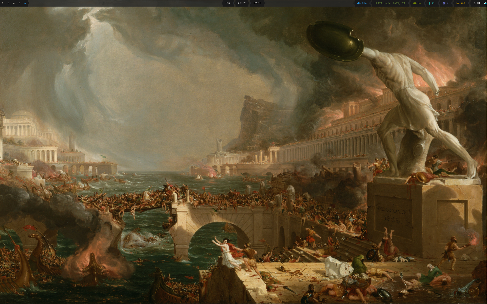
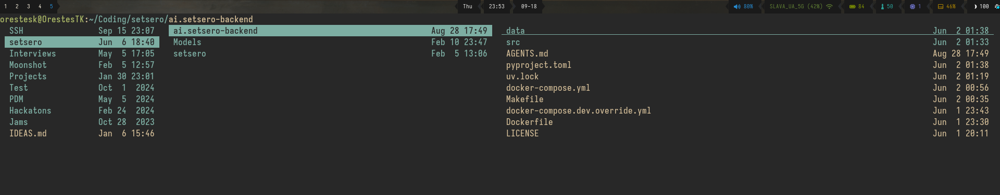
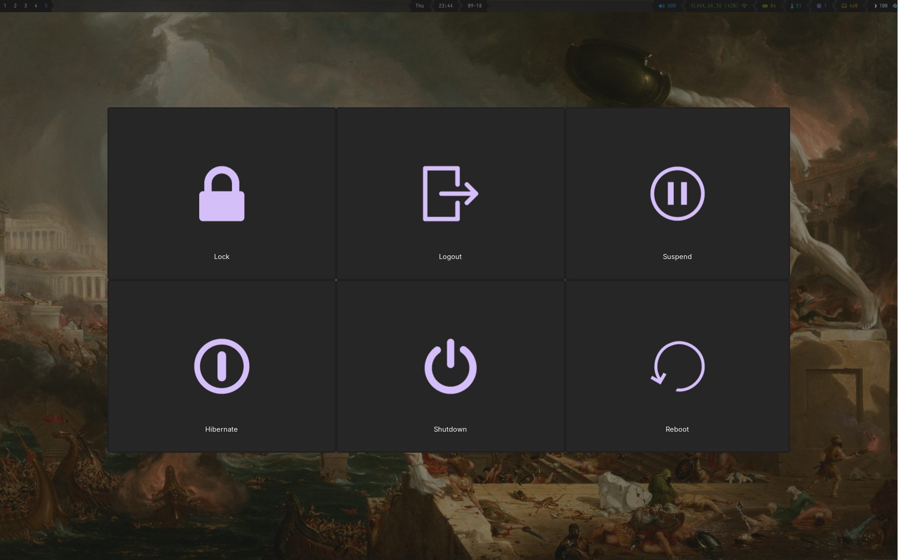

# Dotfiles

## Environment

*   **OS:** Arch Linux
*   **Window Manager:** Sway (Wayland)
*   **Terminal:** wezterm
*   **Shell:** zsh
*   **Bar:** waybar
*   **Editor:** nvim [config][https://github.com/OrestesK/nvim]

---

## Sway

*   **Configuration:** Separate files for `appbinds`, `rules`, `startup`, `swaybinds`, and `visuals`
*   **Core:**
    *   **Window navigation:** vim style | `$mod+` `h` `j` `k` `l` | `alt+tab` to switch between windows
    *   **App Launcher:** `sway-launcher-desktop` | `$mod+d`
    *   **Logout Menu:** `wlogout` | `$mod+Control+l`
    *   **Media & Hardware Controls**

*   **Utility:**
    *   **Screenshot:** `grim` `slurp` | `PrtSc`
    *   **OCR Screenshot:** `tesseract` Copy text contents into clipboard | `$mod+Shift+o`
    *   **Screen Record:** `wf-recorder` Start and stop recording  | `$mod+Shift+r` & `$mod+Shift+s`
    *   **Clipboard History:** `cliphist` | `$mod+c`
    *   **Color Picker:** `$mod+Shift+p`
    *   **Transparency:**: Toggle | `$mod+a`
*   **Misc:**
    *   No borders, no desktop, no animations
    *   Custom wallpaper
    *   Disabled mouse acceleration
    *   Disabled caps lock

---

## Waybar

Based on [cjbassi][https://github.com/Alexays/Waybar/wiki/Examples#cjbassis-configuration]

---

## Zsh

`antidote` plugin manager
`powerlevel10k` prompt

*   **Configuration:** Separate files for `aliases`, `binds`, `core`, `custom`, `exports`, `history_config`, `p10k`, and `zsh_plugins`
*   **Commands:**
    *   `saveshot`: saves screenshot to file
    *   `dupe`: duplicates terminal
*   **Core Plugins:**
    *   `sudo`: `Esc` twice to repeat command with sudo
    *   `vi-mode`: enter normal mode with `Esc`
    *   `zsh-history-substring-search`: cycle through history substring matches
    *   `copyfile` `copypath` `extract`

---

## Wezterm - Terminal Emulator

`Gruvbox Material` theme
`Iosevka Term Medium"` font

---

## lf - Terminal File Manager

- Switch to selected directory on exit
- Preview files

---

## wlogout

---

## Other programs

`easyeffects`: audio presets for PipeWire
`mako`: notifications
