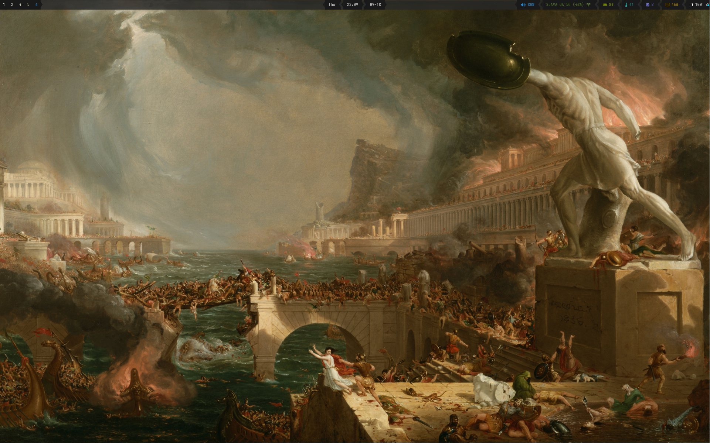
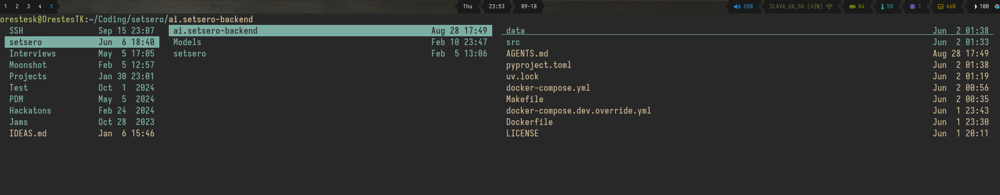
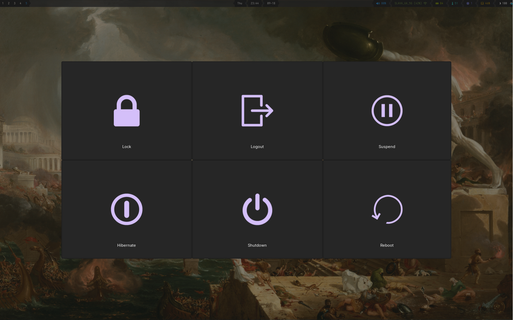

# Dotfiles

## Environment

*   **Hardware:** ThinkPad X1 Carbon Gen 13
*   **OS:** Arch Linux
*   **Window Manager:** Sway (Wayland)
*   **Terminal:** foot
*   **Shell:** zsh
*   **Bar:** waybar
*   **Editor:** nvim [config](https://github.com/OrestesK/nvim)

---

## Sway

*   **Configuration:** Separate files for `appbinds`, `rules`, `startup`, `swaybinds`, and `visuals`
*   **Core:**
    *   **Window navigation:** vim style | `$mod+` `h` `j` `k` `l` | `alt+tab`
    *   **App Launcher:** `sway-launcher-desktop` | `$mod+d`
    *   **Logout Menu:** `wlogout` | `$mod+Control+l`
    *   **Volume/Brightness/Media:** hardware keys + waybar signal refresh

*   **Utility:**
    *   **Screenshot:** `grim` + `slurp` | `PrtSc`
    *   **OCR Screenshot:** `tesseract` to clipboard | `$mod+Shift+o`
    *   **Screen Record:** `wf-recorder` toggle | `$mod+Shift+r`
    *   **Speech to Text:** `hyprvoice` toggle | `$mod+z`
    *   **Clipboard History:** `cliphist` | `$mod+c`
    *   **Color Picker:** `wl-color-picker` | `$mod+Shift+p`
    *   **Transparency:** toggle | `$mod+a`
    *   **Bluetooth/Wi-Fi:** `bluetuith`/`nmtui` via fzf | `$mod+b`

*   **Misc:**
    *   No borders, no desktop, no animations
    *   Custom wallpaper
    *   Disabled mouse acceleration and caps lock
    *   Mouse scroll factor 0.5

---

## Waybar

Based on [cjbassi](https://github.com/Alexays/Waybar/wiki/Examples#cjbassis-configuration)

---

## Zsh

`antidote` plugin manager, `powerlevel10k` prompt

*   **Configuration:** Separate files for `aliases`, `binds`, `core`, `custom`, `exports`, `history_config`, `p10k`, and `zsh_plugins`
*   **Commands:** `saveshot` (save screenshot), `dupe` (duplicate terminal)
*   **Core Plugins:**
    *   `sudo`: `Esc` twice to repeat command with sudo
    *   `vi-mode`: enter normal mode with `Esc`
    *   `zsh-history-substring-search`: cycle through history substring matches
    *   `copyfile` `copypath` `extract`

---

## Foot

`Gruvbox` theme, `JetBrainsMono Nerd Font` size 13

Install `foot-terminfo` for extended terminal capabilities.

---

## Scripts

Custom scripts for power management, screen recording, lock screen, and build config.

See [scripts/README.md](./scripts/README.md)

---

## lf

Terminal file manager — switches to selected directory on exit, file previews.

---

## wlogout

---

## System Configuration

Settings outside `~/.config` worth documenting for reinstalls.

*   **makepkg** (`~/.makepkg.conf`) — tracked in `scripts/`, symlinked. Parallel compilation, builds in `/tmp/makepkg`, zstd with `-T0`.
*   **TLP** (`/etc/tlp.conf`) — battery thresholds 75-80%, `PCIE_ASPM_ON_BAT=powersupersave`, Bluetooth USB excluded from autosuspend.
*   **Filesystem** (`/etc/fstab`) — btrfs subvolumes (`@`, `@home`, `@swap`), `noatime,compress=zstd:3,ssd,discard=async,space_cache=v2`.
*   **PAM** (`/etc/pam.d/swaylock`) — includes `login` config, fingerprint auth via `swaylock-fprintd` + `fprintd`.

---

## Other Programs

*   `easyeffects` — audio presets for PipeWire
*   `mako` — notifications
*   `wl-mirror` — screen sharing mirror
*   `lazygit` — git TUI (config tracked, `delta` as pager)
*   `git-spice` — git PR stacking
*   `zoxide` — smart cd
*   `croc` — file sharing
*   `obsidian` — notes
*   `qalculate` — calculator
